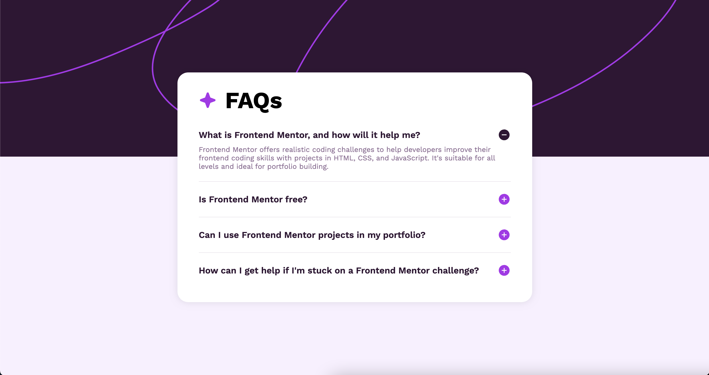

# Frontend Mentor - FAQ accordion solution

This is a solution to the [FAQ accordion challenge on Frontend Mentor](https://www.frontendmentor.io/challenges/faq-accordion-wyfFdeBwBz). Frontend Mentor challenges help you improve your coding skills by building realistic projects. 

## Table of contents

- [Overview](#overview)
  - [The challenge](#the-challenge)
  - [Screenshot](#screenshot)
  - [Links](#links)
- [My process](#my-process)
  - [Built with](#built-with)
  - [What I learned](#what-i-learned)
- [Author](#author)

## Overview

### The challenge

Users should be able to:

- Hide/Show the answer to a question when the question is clicked
- Navigate the questions and hide/show answers using keyboard navigation alone
- View the optimal layout for the interface depending on their device's screen size
- See hover and focus states for all interactive elements on the page

### Screenshot



### Links

- Solution URL: [Click here](https://www.frontendmentor.io/solutions/faq-accordion-using-semantic-html-css-and-javascript-YCyO3kDzhd)
- Live Site URL: [Click here](https://lucasmartintoth.github.io/FAQ_accordion/)

## My process

### Built with

- Semantic HTML5 markup
- CSS custom properties
- Flexbox
- CSS Grid
- Mobile-first workflow

### What I learned

#### HTML TAKEAWAYS

My major HTML takeaway was using the `<details>` and `<summary>` semantic tags to create these accordion-like structures, really useful in FAQs and other Sections on websites.

```html
<details>
      <summary>What is Frontend Mentor, and how will it help me?
        
      </summary>
      <p>Frontend Mentor offers realistic coding challenges to help developers improve their 
      frontend coding skills with projects in HTML, CSS, and JavaScript. It's suitable for 
      all levels and ideal for portfolio building.</p>
    </details>
```

#### CSS TAKEAWAYS

Learning how to import custom fonts using the `@font-face` at-rule is significant, as it allows me to achieve better and more autoral designs in the sites and apps I'll develop.

```css
@font-face {
    font-family: 'Work Sans';
    src: url(./assets/fonts/WorkSans-VariableFont_wght.ttf) format('truetype');
}

@font-face {
    font-family: 'Work Sans';
    src: url(./assets/fonts/WorkSans-Italic-VariableFont_wght.ttf) format('truetype');
    font-style: italic;
}
```

#### JAVASCRIPT TAKEAWAYS
The `.forEach` method allows me to iterate through arrays, executing a provided function once for each element in the array.

```js
faqDetails.forEach(function(detail) {
    const icon = detail.querySelector('.faq-icon');

    detail.addEventListener('toggle', function() {
        if (detail.open) {
            icon.src = './assets/images/icon-minus.svg';
        } else {
            icon.src = './assets/images/icon-plus.svg';
        }
    })
});
```

## Author

- Frontend Mentor - [@LucasMartinToth](https://www.frontendmentor.io/profile/LucasMartinToth)
